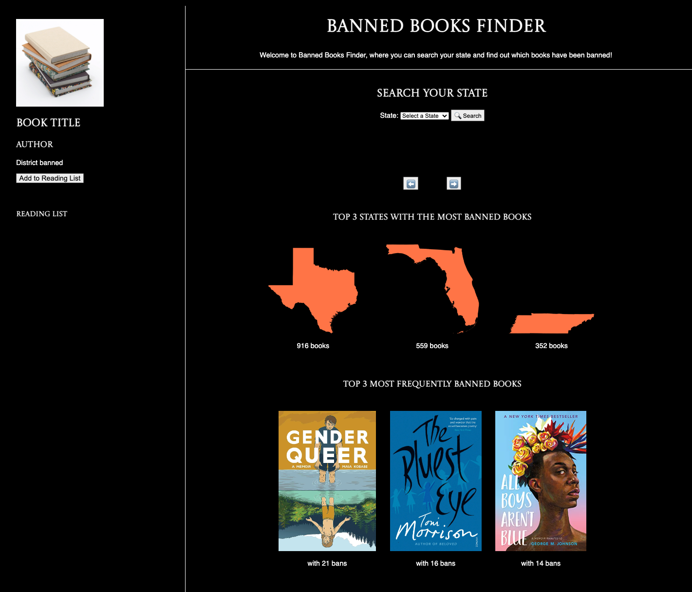
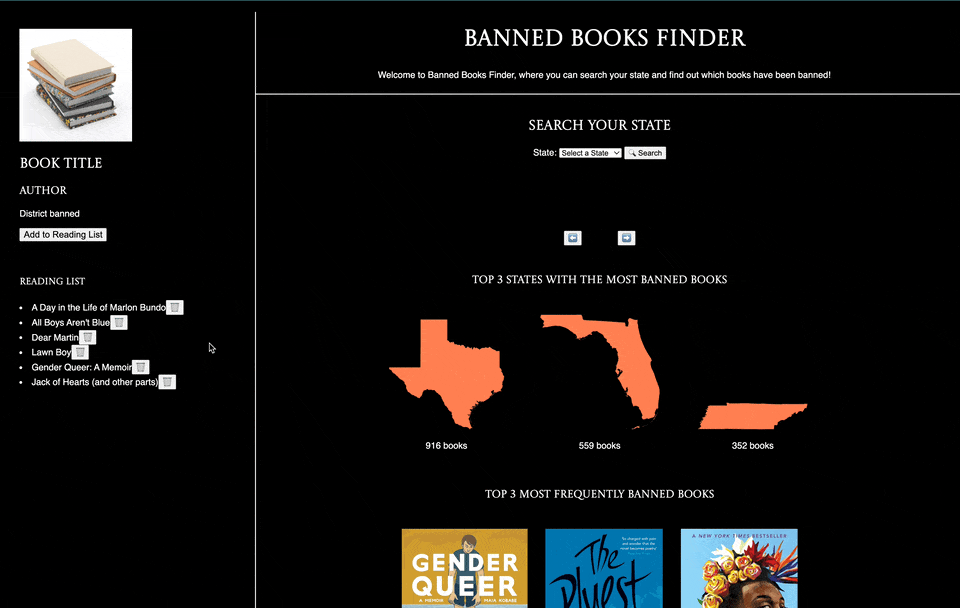

# banned-book-finder

 

 Created by Sam Iacavazzi and Clae Lu

 We created a site that fetches from two databases, one being the Pen America Index of School Book Bans in Fall 2022 (https://pen.org/index-of-school-book-bans-2022/) and Open Library API.

 Our first database is a list of books banned in the first half of the 2022-2023 school year. From the site, "PEN America found 1,477 instances of individual books banned, affecting 874 unique titles. This represents an increase from the prior six months, from January to June 2022, in which 1,149 instances of book banning were recorded."

 With our site, you can search the books banned in each state, browse through the books, click on a book to see details, and then add books you'd like to read to a 'Reading List'.

 The bottom of our site has two sets of fun facts, the top 3 states with the banned books, which are Texas, Florida, and Tennessee, and the top 3 most frequently banned books in the dataset, which are Gender Queer, The Bluest Eye, and All Boys Aren't Blue. 

 ## Instructions

 To run this project site locally:
 - Clone the repository
 - Open the index.html in your browser
 - Open up Terminal and cd into the repository's directory
 - Run 'json-server --watch db. json' in the terminal to start up the db.json

 